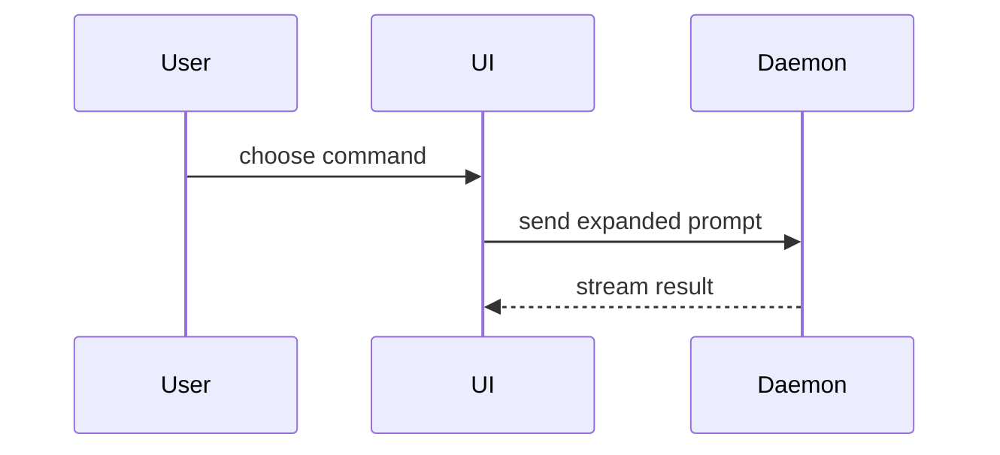

# Show me

Pick the smallest view that makes the point, put it next to the short prose it
supports, and stop. The failure this skill exists to prevent is not an ugly
diagram — it is a correct one that nobody needed, drawn because drawing was
asked for. A picture that restates the paragraph above it costs the reader
twice: once to read the paragraph, once to discover the picture added nothing.

Everything here is static. **If the reader needs to drive it** — a slider that
moves real numbers, a state machine they step through, a tour that pauses —
stop and use `wtf-explainer`, which builds a running simulation. If nothing
moves, it belongs here.

## Pick by destination first

The forms are not interchangeable across destinations, and the way this fails
is silent: a Mermaid fence in a terminal is a screenful of arrow syntax where a
diagram was promised, and it looks like a rendering bug rather than a wrong
choice.

| Destination | What actually renders | Reach for |
|---|---|---|
| this conversation, a terminal | fenced text only — a Mermaid fence stays raw source | pseudocode, call tree, component tree, file tree, and diffs of each |
| a PR body, a `.md` file, an Artifact | GitHub, and most Markdown viewers, render Mermaid | all of the above, plus Mermaid |
| a page opened locally | anything | one HTML file — see the last section |

## Then pick by what you are showing

Logic or an algorithm — pseudocode:

```text
on(save)
  if content is unchanged
    return cached result
  write new content
  return fresh result
```

Runtime control flow — a call tree:

```text
submitForm
  createSession
    persistPrompt
    launchAgent
  navigateToSession
```

UI structure — a component tree, carrying the state and module boundaries that
matter and nothing else:

```tsx
<SessionPage> (apps/example/src/routes/session.tsx)
  useSessionEvents()
  <SessionToolbar>
    <RunSkillButton> (packages/ui)
```

File responsibility, or a broad refactor — a shallow file tree:

```text
src/
├── commands/       # parses user actions
├── sessions/       # owns session state
└── transport/      # sends API requests
```

Two components talking, over time — Mermaid, where the destination renders it:



When most of the block is new, when omitted context would hide ownership or
order, or when the reader needs a copyable target shape — show the real code:

```ts
function expandSkill(command: string): string {
  const skillName = command.slice(1)
  return `use the ${skillName} skill`
}
```

## Use `diff` when the shape already exists

When the point is *what changed* rather than what is there, render the form
above as a `diff` instead of drawing two of them. Match the diff's shape to the
subject — these are the forms `/wtf-create-pr` reaches for, because a PR is
about a change.

A component change:

```diff
 <SessionPage>
   useSessionEvents()
   <SessionToolbar>
+    <RunSkillButton />
   <SessionTimeline>
+    <SkillResultCard />
```

A file-layout change:

```diff
 src/
 ├── commands/
+│   └── show-me.ts       # expands the slash command
 ├── sessions/
-└── transport.ts
+└── transport/
+    ├── client.ts
+    └── stream.ts
```

A call-tree change:

```diff
 submitForm
   createSession
     persistPrompt
+    expandSkillMention
     launchAgent
-  navigateToSession
+  navigateToSession
+    subscribeToEvents
```

A state or control-flow change:

```diff
 on(save)
-  write content
+  if content is unchanged
+    return cached result
+  write new content
+  invalidate cache
```

## Rules

**Never draw what you have not read.** Every node names a real symbol at a real
path, taken from the file rather than from a plausible naming scheme. A diagram
is read as *checked* in a way a sentence is not — a reader who would question
"it calls `launchAgent` next" accepts the same claim without a blink once it is
a node in a tree. So an inferred call tree is not a rough sketch, it is a
confident wrong map, and it is believed for exactly as long as it takes someone
to act on it.

**Keep only what answers the question asked.** Every extra call, file, prop,
state and boundary is a claim the reader has to check, and it competes with the
one that mattered. A tree that shows the whole module to establish where two
functions sit has hidden them.

**One form, or two. Never all of them.** The menu above is a menu.

**If prose says it in one line, say the line.** Not everything asked as "show
me" wants a drawing; sometimes it wants an answer.

## When a fence is not enough

A visual UI, a layout, a side-by-side state comparison, a concept too dense for
Mermaid — write one focused HTML file: a diagram, an infographic, or a short
slide deck, whichever fits the point. Match the product's colours, type and
spacing, use real labels and real data, and make it work on a phone as well as
a desktop.

**Write it to this session's scratch directory, not the working tree.** A
`show-me-*.html` dropped in the repo turns up in `git status`, reads as
something the branch meant to add, and gets committed with it — a file in the
history of a change it had nothing to do with, when it was written to be thrown
away. Then open it:

```
Bash(open <scratch>/show-me/{topic}.html)
```

One file, no build step, no CDN — it has to open from `file://` on a machine
with no network. If it wants a framework, the subject has outgrown this skill.

---

Adapted from the `show-me` skill in
[humanlayer/skills](https://github.com/humanlayer/skills) (MIT — see `LICENSE`).
The form catalogue and its examples are upstream's. Local: the destination
table, the "never draw what you have not read" rule, the scratch-directory
placement for the HTML branch, and the `/wtf-create-pr` handoff.
